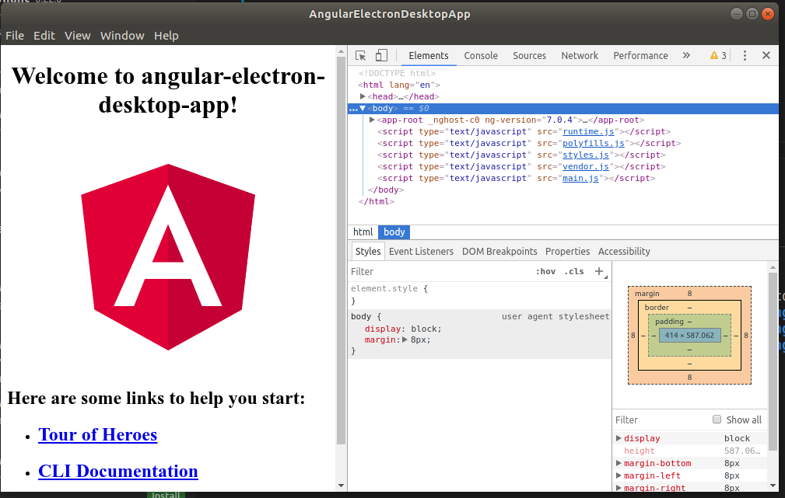

# AngularElectronDesktopApp

### How to build a Desktop Application with Electron and Angular

### Electron

> If you can build a website, you can build a desktop app. Electron is a framework for creating native applications with >web technologies like JavaScript, HTML, and CSS. It takes care of the hard parts so you can focus on the core of your >application.

Refer this link: https://electronjs.org/

### How to install electron in angular cli

Create main.js file in the root folder and paste the below code

```
const {app, BrowserWindow} = require('electron')
let win = null;
function createWindow() {
  // Initialize the window to our specified dimensions
  win = new BrowserWindow({width: 1000, height: 600});
  // Specify entry point
  win.loadURL('http://localhost:4200');
  // Show dev tools
  // Remove this line before distributing
  win.webContents.openDevTools()
  // Remove window once app is closed
  win.on('closed', function () {
    win = null;
  });
}

app.on('ready', function () {
  createWindow();
});
app.on('activate', () => {
  if (win === null) {
    createWindow()
  }
})
app.on('window-all-closed', function () {
  if (process.platform != 'darwin') {
    app.quit();
  }
});

```

Add the below line in package.json file

```
"main": "main.js"
```

### Install Electron in angular cli

```
npm install -g electron

```

We are ready to run the application now.

First, start the angular server using

```
npm start

```

In a separate window, we launch electron by running this command

```
electron .

```

### Screenshot



### Happy coding
